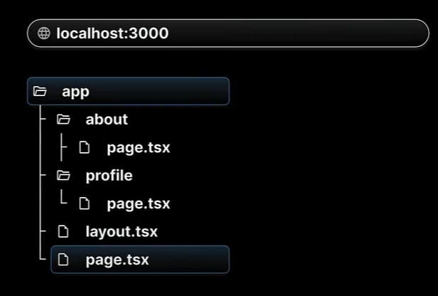

# nextjs-tutorial

## 1. Création de projet

Commandes:

- npx create-next-app@latest: créer le projet
- npm run dev: démarer l'appli

## 2. Project structure

Lorqu'on lance `npm run dev`, l'exécution commence par package.json, puis layout.tsx et renvoie RootLayout component. Le server localhost:3000 cheche le component qui se trouve dans le fichier page.tsx

- package.json : contient les dépences du projet et le scrypt
- next.config.ts: fichier de configuration
- tsConfig.json: fichier de configuration de typeScript
- eslint.config.mjs: pour eslint
- tailwind.config.ts: configuration de tailwind
- next-env.d.ts: fichier de déclaration de typeScript
- globals.css: fichier de style de l'application
- layout.tsx: partage des éléments de l'interface utilisateur à travers les pages
- page.tsx: crée ce qui s'affiche sur l'UI

## 3. Les concepts fondamentaux de nextjs

### React Server Components (RSC)

React server components est une nouvelle architecture qui a été introduite par l'équipe et rapidement adoptée par Next.js
Elle introduit une nouvelle approche pour céer les composantes React en les divisant en deux types distincts:

- Composantes server (server Componentes): par défaut, nextjs traite toutes les composantes comme les composantes server. Il peut faire des taches liées à la base de données
- Composantes client (Client Components): pour créer un client component, on doit ajouter `use client` dans le fichier.

### Routing

Next.js a un file-system basé sur routing sytem. Ce qui veut dire que les URLS peuvent accéder au navigateur par comment tu organise tes fichiers dans le code.

#### Routing conventions

- Toutes les routes doivent être dans le fichier `app`
- tous les fichiers doivent s'appeler `page.tsx`
- chaque fichier représente un segement du path de l'URL
- le fichier `layout.tsx` est obligatoire

##### Exemples

- créer la HomePage
- Créer ABoutPage
  - Créer un dossier about
  - ajouter un fichier page.tsx
- Crer profile page
  - Créer un dossier profile
  - Créer un fichier page.tsx

Si la route n'existe pas, next js renvoie la page 4040 par défaut.
